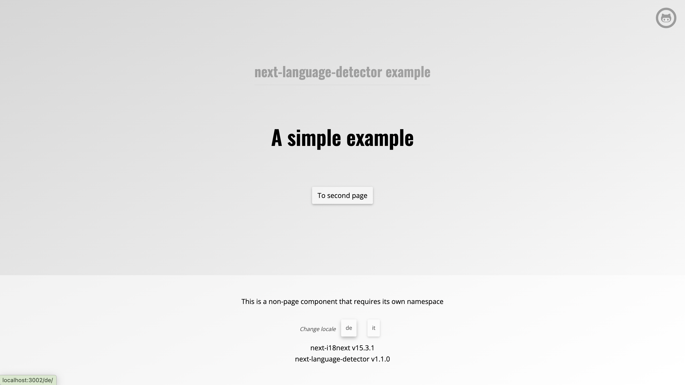

TS + REACT **ONLY**

# i18n example

## 1-next-i18n


```bash
yarn dev
```

http://localhost:3000

## 2-next-admin


```bash
yarn dev
```

http://localhost:80

# 3-next


```bash
yarn dev
```

http://localhost:3000

# 4-ssg



```bash
npm run dev
```

http://localhost:3000
