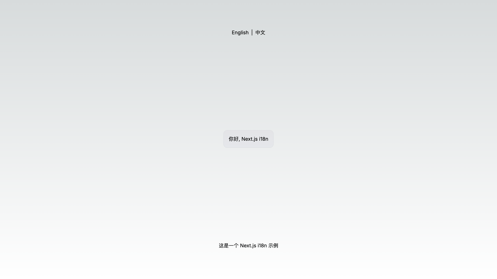

TS + REACT **ONLY**

# i18n example

## 1-next-i18n



```bash
yarn dev
```

http://localhost:3000

## 2-next-admin


```bash
yarn dev
```

http://localhost:80

# 3-next


```bash
yarn dev
```

http://localhost:3000

# 4-ssg


```bash
npm run dev
```

http://localhost:3000

# 5-next-simple


```bash
yarn dev
```

http://localhost:3000

# 6-next


```bash
npm install
npm run dev
```

http://localhost:3000

# 7-next-menu


```bash
yarn dev
```

http://localhost:3000

# 8-route


```bash
yarn dev
```

http://localhost:3000

# Create

```bash
npx create-next-app --example app-dir-i18n-routing i18n-app

```

# Docs

https://next-intl-docs.vercel.app/docs/usage
